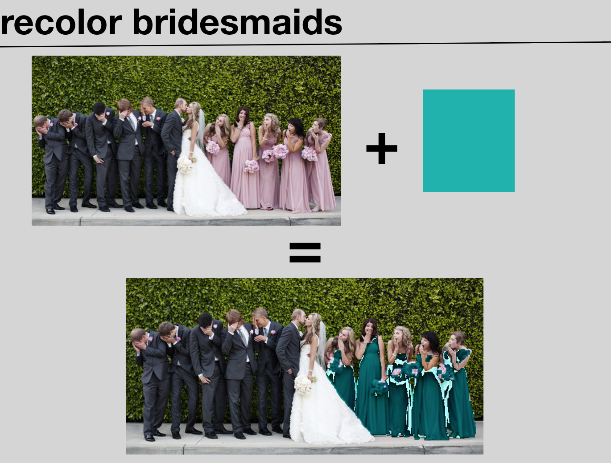
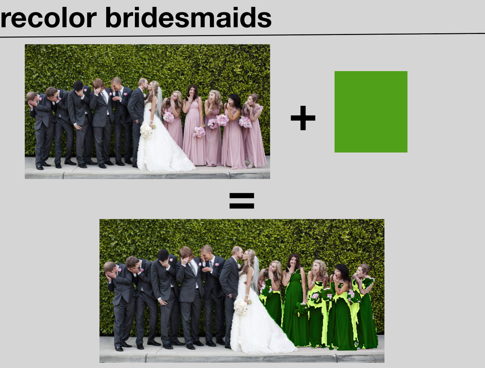

# ReColor🎨  Wedding👰   Party🎉

Quick tool for trying to help visualize wedding party outfits.

Uses Python🐍 & OpenCV💻👀

##### First pass ~cherry picked~ output:
---

  <kbd>
    
  </kbd>

  <kbd>
    
  </kbd>

