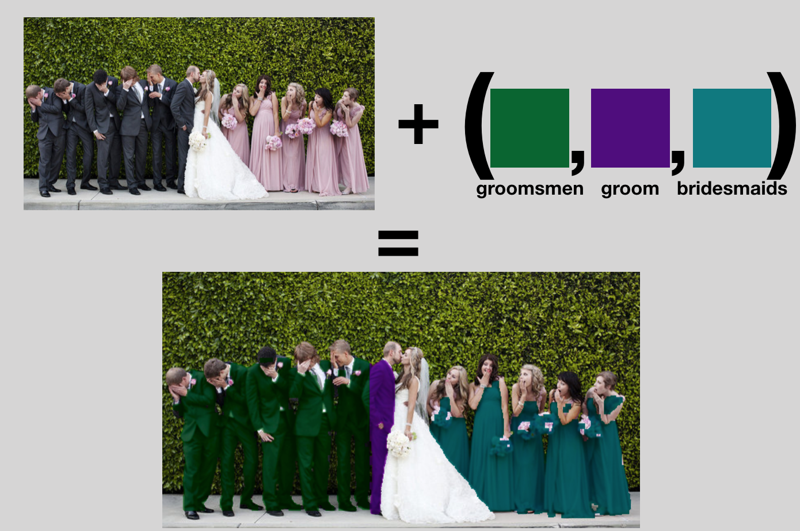

# ReColor🎨  Wedding👰   Party🎉

Quick tool for trying to help visualize wedding party outfits.

Uses Python🐍 & OpenCV💻👀

##### Example output:
---

<table width="500" border="0" cellpadding="5">
    <tr>
        <td align="center" valign="center">
            
             
            Input
        </td>
        <td align="center" valign="center">
            
             
            Output
        </td>
    </tr>
</table>
