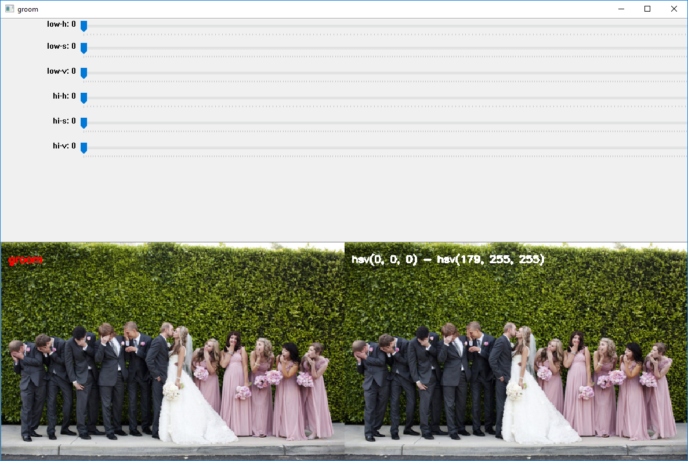

# ReColor🎨  Wedding👰   Party🎉

Quick tool for trying to help visualize wedding party outfits.

Uses Python🐍 & OpenCV💻👀

##### Example output:
---

<p align='center'>
  
</p>

## Usage

*This project requires the installation of OpenCV. 
If you're having trouble installing it, please check StackOverflow and 
other sources for help.*

### Step 1 - Identify regions to recolor

#### HSV Filtering

You will need to specify the image to be modified, a directory to store the output and a 
list of names for the regions you want to recolor. For the image above, you would call
it like this:

```bash
python filter_rois.py -i images/party_pink.jpg -o data -l groom groomsmen bridesmaids
```

This will open a window where you'll filter the HSV values of the image to 
select the color region to modify for each label you provided. We'll provide filters 
for three regions, the *groom*, the *groomsmen* and the *bridesmaids*. Note the label 
being selected for appears in red text in the left image (groom in this case). 

<p align='center'>
  
</p>

As you adjust the HSV filters, you'll see a live preview of the mask being applied
to the image. Filter to where only the portion of the image you want to recolor is visible.
In this example, the groom is wearing the same color suit as the groomsmen so you won't 
remove them (that will be the next part).

<p align='center'>
  
</p>

Once you're happy with your HSV filter, press the ESC key to move on to image cropping.

#### Image Cropping

Now you need to crop the image to only the portion containing the subject. 
You have four filters to achieve this: 
 - *x* sets the position on the horizontal axis of the top left corner of the cropping box. 
 - *y* sets the position on the vertical axis of the top left corner of the cropping box.
 - *w* sets the width of the cropping box.
 - *h* sets the height of the cropping box.
 
Make sure you first set *w* and *h* to be greater than 0 so you can see the region 
you're cropping.

<p align='center'>
  
</p>

Once you're happy with your cropping box, press the ESC key to move on to the next label.

#### Final

Once you've filtered and cropped the image for each label (pressing ESC for the last step)
a .csv file will be saved to the specified directory with the same name as the image file
processed.

### Step 2 - Apply new colors to image

Step 1 output a data file (*data/party_pink.csv* in this example) containing the filter 
and cropping specifications. This, the image and a .csv specifying the new RGB colors 
to apply to each region needs to be provided. You will need to create the .csv with the
new colors following the structure of the example provided. Each column needs to be named 
identically to the labels provided in step 1.

```bash
python recolor.py -i images/party_pink.jpg -d data/party_pink.csv -c data/party_pink_new_colors.csv
```